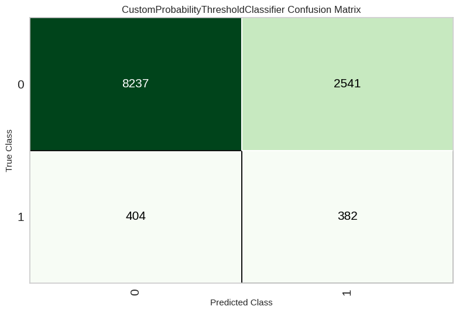
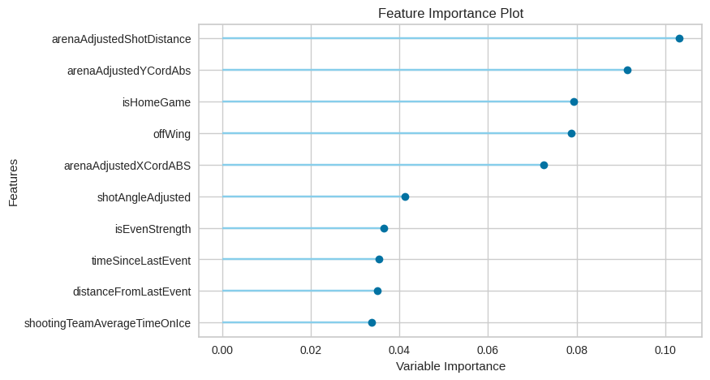

# **Colorado Avalanche Goal Prediction with Binary Classifier Models**

MSDS696: Data Science Practicum II

Author: Lonny Cox-Lauf

Link to presentation recording: LJC TO DO add this!

## High-Level Project Description

This code trains Machine Learning binary classifier models to predict whether shots taken by the Colorado Avalanche team resulted in goals.

## Purpose and Motivation

In the sport of hockey, as with all sports nowadays, stat analytics has been highly prevalent in recent years. This is partially due to increase in technology and database capabilities for holding vast amounts of team and player data, but also it is prevalent because analysts and franchises are catching on to the many benefits that it can offer. For example, further statistical analysis on expected goals in the National Hockey League (NHL) can result in:

* Coaching and play design for their teams (taking "smarter" shots during games)
* Building more fan engagement, as fans will enjoy more commentator discussion on expected goals versus actual goals
* More media coverage options, such as adding shot statistics real-time to the streams or during replays, amplifying the experience
* Increased revenue, as sponsorship on certain statistical analysis portions during game coverage ("shot speed, brought to you by Toyota", etc.)

## How to Run the Project in Google Colab

1. From https://moneypuck.com/data.htm scroll down and locate the "Download Shot Data" section
2. From the data folder of this repo, download all the .zip files ("shots_20XX.zip") from 2007 season to 2023
3. Move all the .zip files from Step 2 into a Google Drive location of your choosing
4. Open Google Colab: https://colab.research.google.com/
5. In Colab, click File > 'Open Notebook'
6. In the pop-up window, select the GitHub tab, then copy and paste this GitHub repository high level link in the field box: [https://github.com/LonnyCox55/MSDS696_NHLExpectedGoalPrediction/tree/main](https://github.com/LonnyCox55/MSDS696_NHLExpectedGoalPrediction)
7. You should now see the main.ipynb file that can be opened up, click that and the Python Jupyter Notebook file will open in Colab
8. Edit cell #5 (where the !unzip commands occur) to match where the .zip files were placed in your personal Google Drive folder of choice
9. Run all cells

## Dataset Description

Money Puck's website has historical shot-related data from NHL games starting from way back in the 2007-2008 season (in CSV format). This data contains shots from all the NHL teams, and every single unblocked shot is recorded. There are a total of 124 attributes for each of these shots. In total, there are 1,717,746 shots when adding all of the CSV files together for each season (from the 2007-2008 season through the 2022-2023 season). Money Puck updates the CSV file for the current season (2023-2024) regularly with new shot data as the games occur. Money Puck scrapes most of this shot data from the ESPN and NHL websites.

**Link to the dataset**: https://moneypuck.com/data.htm

## Data Cleaning

Some steps taken to clean the NHL shot-related data to fit my project's needs were as follows:

* Remove games that did not involve the Avalanche 
* Remove empty net shots
* Remove shots taken by the team opposing the Avalanche
* Remove any duplicate or unneccesary attributes (columns)
* Generate new features based on existing features, such as Power Play vs. Even Strength or Home vs. Away game
* Fill in missing shot type data with "Wrist", as wrist shots are the most common in hockey
* Fill in missing player position data with "Center", as Centers historically take more shots than any other position in hockey
* And more...

The biggest challenge, however, was addressing the data imbalance between the number of goal samples versus the number of non-goal samples. In other words, the Avalanche have taken almost 58,000 shots since 2007, but only about 4,000 of those shot went into the net. That means the ratio of goals to non-goals is only approximately 0.07295. Ideally, to train a model we would like that ratio to be closer to 0.5. To address this imbalance, we oversample the minority set (goals) using synthetically generated data (Synthetic Minority Oversampling Technique, or SMOTE for short), while we strategically undersample the majority (non-goals) using Tomek-Links to make the decision boundary a little more obvious.

## Results

See below for the confusion matrix created by PyCaret depicting the number of true/false positives (goals) and true/false negatives (non-goals) when evaluating the best model from this project:

From PyCaret, we can also sort the features in order from most important to least important. This is called a feature importance plot, and below we can see the top 10 most important features as determined by our PyCaret-created model:

## Conclusion

In summary, the models did not produce results as accurate as initially hoped, but the model is still far more beneficial for predicting goals than simply making a random choice based on how often goals are made. Because of this, I'd consider the project successful. In addition, luck is a very key factor in the game of hockey, and luck is not something easily accounted for in a Machine Learning model. Using an expected goals or goal prediction statistic can be beneficial to the NHL for various reasons, such as providing the Avalanche franchise coaching staff some valuable shot characteristics to practice in order to increase the team's chance for more goalmaking.
